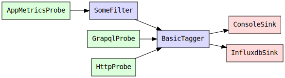
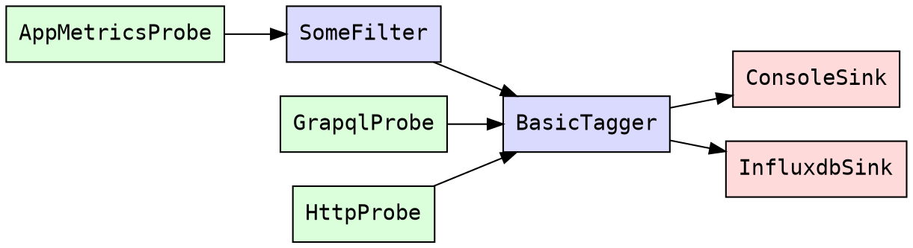
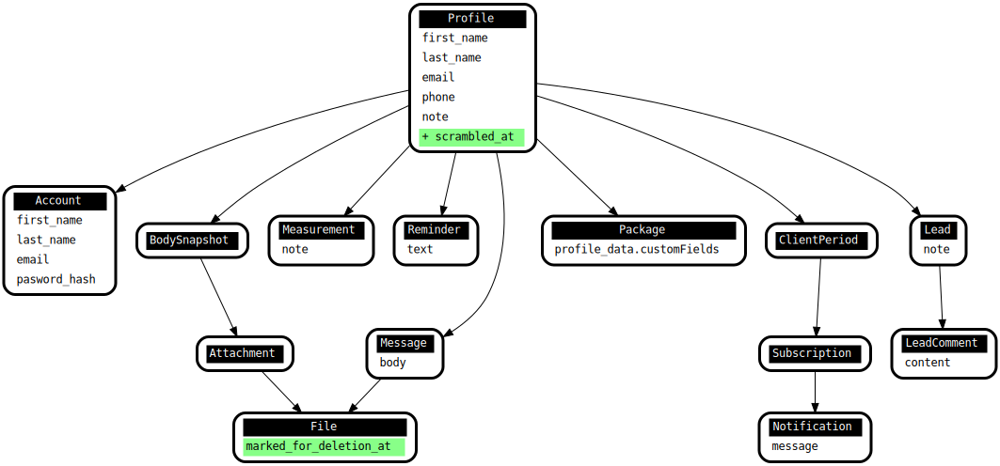
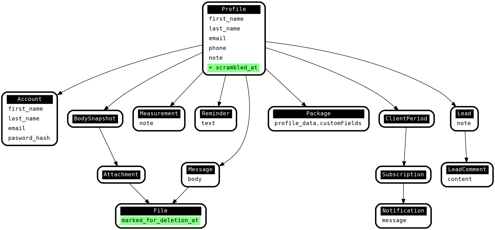

# usage

```sh
node index.js README.md
```



<details><summary>code</summary>


```dot test_graph.svg
  digraph {
    rankdir=LR;
    node [fontname=monospace shape=box]
    nodesep=0.3;
    subgraph {
      node [shape=box style="filled" fillcolor="#00ff0025" ]
      AppMetricsProbe
      GrapqlProbe
      HttpProbe
    }
    subgraph {
      node [shape=box style="filled" fillcolor="#ff000025" ]
      ConsoleSink
      InfluxdbSink
    }
    subgraph {
      node [shape=box style="filled" fillcolor="#0000ff25" ]
      BasicTagger
      SomeFilter
    }

    AppMetricsProbe -> SomeFilter -> BasicTagger
    HttpProbe -> BasicTagger
    GrapqlProbe -> BasicTagger
    BasicTagger -> ConsoleSink
    BasicTagger -> InfluxdbSink
  }
```

</details>




<details><summary>code</summary>


```dot test_graph2.svg
  digraph {
    rankdir=TB;
    node [fontname=monospace shape=box fillcolor="#00ffff25"]
    nodesep=0.3;
    node [shape=Mrecord style="filled" fontname="Monospace" penwidth=3 fillcolor="white" fontsize=12]
    
    
     Profile [  label =<<table align="left" border="0" cellborder="0" cellpadding="3" bgcolor="white"><tr><td bgcolor="black" align="center" colspan="2"><font color="white">Profile</font></td></tr><tr><td align="left">first_name</td></tr><tr><td align="left">last_name</td></tr><tr><td align="left">email</td></tr><tr><td align="left">phone</td></tr><tr><td align="left">note</td></tr><tr><td bgcolor="#00ff0077" align="left">+ scrambled_at</td></tr></table>> ];
    
     Account [  label =<<table align="left" border="0" cellborder="0" cellpadding="3" bgcolor="white"><tr><td bgcolor="black" align="center" colspan="2"><font color="white">Account</font></td></tr><tr><td align="left">first_name</td></tr><tr><td align="left">last_name</td></tr><tr><td align="left">email</td></tr><tr><td align="left">pasword_hash</td></tr></table>> ];
   
     Message [  label =<<table align="left" border="0" cellborder="0" cellpadding="3" bgcolor="white"><tr><td bgcolor="black" align="center" colspan="2"><font color="white">Message</font></td></tr><tr><td align="left">body</td></tr></table>> ];

     Measurement [  label =<<table align="left" border="0" cellborder="0" cellpadding="3" bgcolor="white"><tr><td bgcolor="black" align="center" colspan="2"><font color="white">Measurement</font></td></tr><tr><td align="left">note</td></tr></table>> ];
   
     Reminder [  label =<<table align="left" border="0" cellborder="0" cellpadding="3" bgcolor="white"><tr><td bgcolor="black" align="center" colspan="2"><font color="white">Reminder</font></td></tr><tr><td align="left">text</td></tr></table>> ];
     
     ClientPeriod [  label =<<table align="left" border="0" cellborder="0" cellpadding="3" bgcolor="white"><tr><td bgcolor="black" align="center" colspan="2"><font color="white">ClientPeriod</font></td></tr></table>> ];
     
     Subscription [  label =<<table align="left" border="0" cellborder="0" cellpadding="3" bgcolor="white"><tr><td bgcolor="black" align="center" colspan="2"><font color="white">Subscription</font></td></tr></table>> ];
     
     Notification [  label =<<table align="left" border="0" cellborder="0" cellpadding="3" bgcolor="white"><tr><td bgcolor="black" align="center" colspan="2"><font color="white">Notification</font></td></tr><tr><td align="left">message</td></tr></table>> ];

     Package [  label =<<table align="left" border="0" cellborder="0" cellpadding="3" bgcolor="white"><tr><td bgcolor="black" align="center" colspan="2"><font color="white">Package</font></td></tr><tr><td align="left">profile_data.customFields</td></tr></table>> ];
     
     BodySnapshot [  label =<<table align="left" border="0" cellborder="0" cellpadding="3" bgcolor="white"><tr><td bgcolor="black" align="center" colspan="2"><font color="white">BodySnapshot</font></td></tr></table>> ];
     
     Lead [  label =<<table align="left" border="0" cellborder="0" cellpadding="3" bgcolor="white"><tr><td bgcolor="black" align="center" colspan="2"><font color="white">Lead</font></td></tr><tr><td align="left">note</td></tr></table>> ];
     
     LeadComment [  label =<<table align="left" border="0" cellborder="0" cellpadding="3" bgcolor="white"><tr><td bgcolor="black" align="center" colspan="2"><font color="white">LeadComment</font></td></tr><tr><td align="left">content</td></tr></table>> ];

    File [  label =<<table align="left" border="0" cellborder="0" cellpadding="3" bgcolor="white"><tr><td bgcolor="black" align="center" colspan="2"><font color="white">File</font></td></tr><tr><td bgcolor="#00ff0077" align="left">marked_for_deletion_at</td></tr></table>> ];
    
    Attachment [  label =<<table align="left" border="0" cellborder="0" cellpadding="3" bgcolor="white"><tr><td bgcolor="black" align="center" colspan="2"><font color="white">Attachment</font></td></tr></table>> ];
   
    Profile -> { Package, Account, Message, Measurement, Reminder, BodySnapshot, ClientPeriod, Lead }
    ClientPeriod -> Subscription -> Notification
    Lead -> LeadComment
    Message -> File
    BodySnapshot -> Attachment
    Attachment -> File
    
  }
```

</details>


